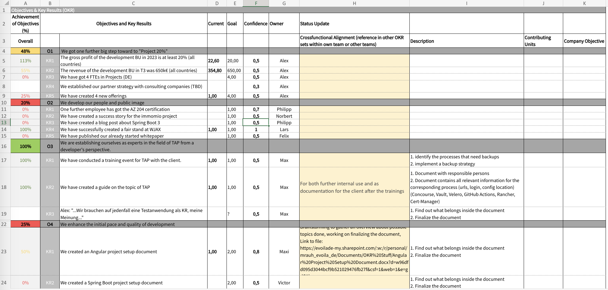
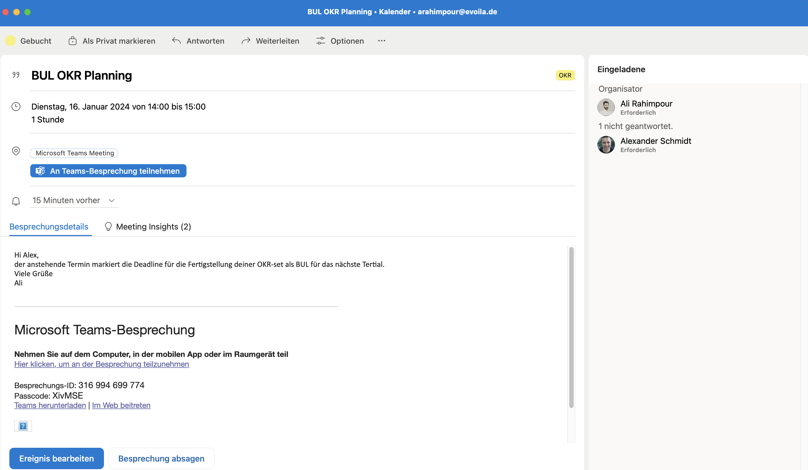
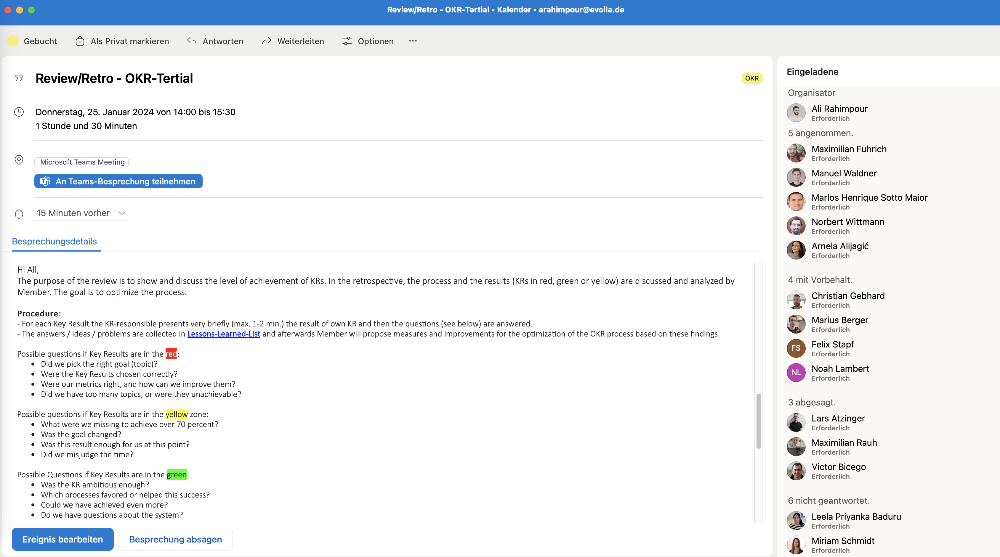
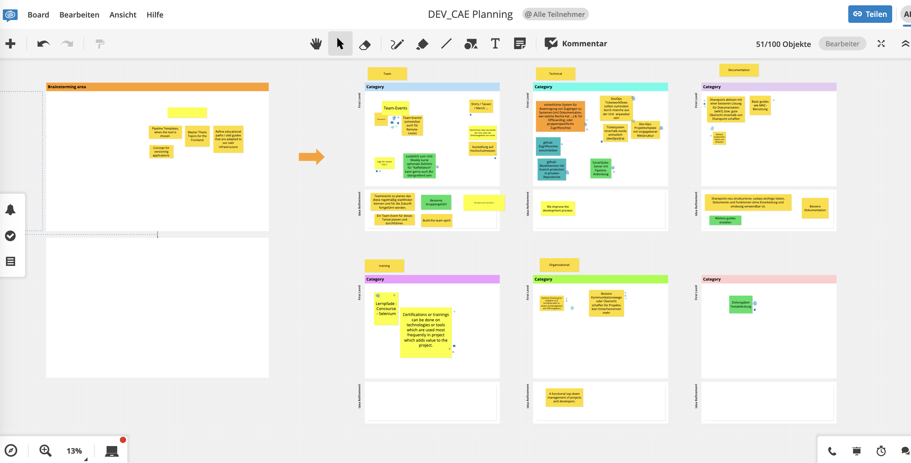
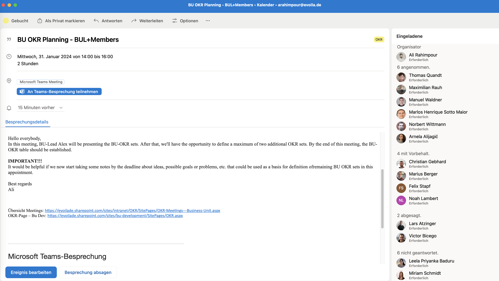
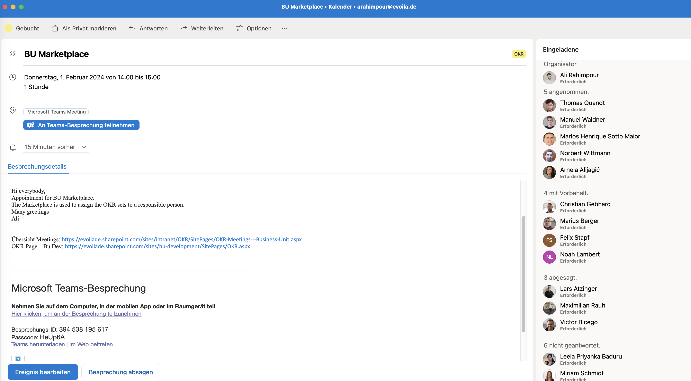
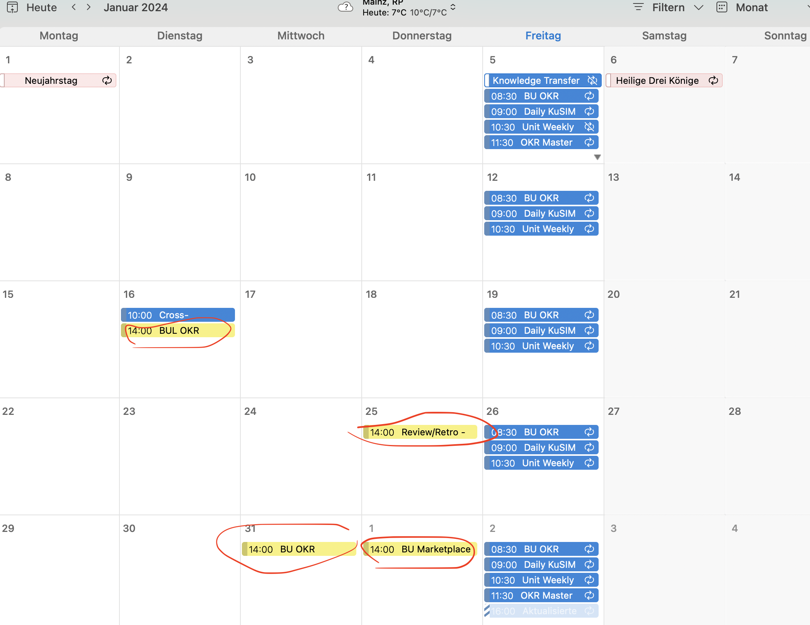

# Tertial Planning:
This is a summary of how I designed the process. As you can see, the way I do it deviates a bit from the OKR guideline, but nothing fundamental has been changed. So, you can tailor your process in detail as it suits you. I would recommend that you just do the first tertial and not worry too much about it being perfect; see how it goes and then adjust the process during the next planning. You will also have retros and reviews later where you can adapt and improve the process.

Currently, we have an OKR (Objectives and Key Results) table for the entire German BU-Dev team. So we will starting next Tertial, there will be a German OKR table and a seprate Bosnian OKR table.

**Our OKR tables (German Dev BU okr table) from this Tertial, for you as an example:**

Our planning process in January includes four main meetings:

## 1. BU-Lead OKR-Set Review:
- **Purpose:** This meeting is exclusively for the BU-Lead (in our case, Alex) and the OKR Master. It serves as a deadline for Alex to present his OKR set that he has already defined.
- **Process:** As the OKR Master, I check whether the OKRs are clearly formulated and measurable and provide suggestions for improvement, etc.
- **Outcome:** By the end of this session, there will be a defined Objective with its associated Key Results, determined by the BU-Lead.
  
    

## 2. Review/Retrospective: (will not take place in Bosnia's first Tertial)
- **Purpose:** Starting from the second Tertial, we conduct a combined review and retrospective session in which all BU members participate.
- **Process:** Each person responsible for a Key Result briefly presents (max. 1-2 mins) their outcomes and shares experiences.
- **Outcome:** Collected insights, ideas, and issues are noted in a 'Lessons Learned' list. Based on this, suggestions for improving the OKR process are developed. Since it's the first Tertial, this meeting will initially be irrelevant, but we can discuss more in the next Tertial.

    

## 3. BU OKR Planning:
- **Purpose:** All BU members are involved in this meeting. It starts with Alex presenting the OKR sets that were already reviewed in the first meeting (BU-Lead OKR-Set Review). Alex presents his OKRs, and any questions are clarified.
- **Process:** There's a sort of brainstorming where all participants note down ideas, challenges, and required technologies on a collaborative board like [Conceptboard](https://conceptboard.com/de/). The points are categorized and discussed to identify potential Objectives and Key Results. I usually give people about 15 minutes to write down their ideas and points, then everyone explains their point, and we can categorize them.

**This is a picture from the end of one of our planning meetings, which was done together in Conceptboard. as example**

  

  [Link to my public board, as an example for you:](https://app.conceptboard.com/board/ek7o-noq0-ec7b-xcc5-mbuu)

- For example, one writes that we need a learning path for Scrum, another writes that we need Spring Boot certifications, and another had a problem that they lack an example Angular Project to quickly initialize a new project. All these can belong to the Education category or whatever one wants to call it, and from this, the following key results can be created:
    - **Example Objective:** "We improve technical competencies and efficiency in project initialization."
    - **Example Key Results:**
        1. "Creation of a learning path for Scrum and publication on Sharepoint."
        2. "Two people obtain a Spring Boot certification."
        3. "Creation and publication of a standardized Angular project template on GitHub."
      
    
  
## 4. Marketplace:
- **Purpose:** All BU members are present, and the OKR table is completed, usually with an OKR set from Alex and additional sets defined in the previous meeting.
- **Process:** In this meeting, individuals are assigned to Key Results, either voluntarily or by assignment.
- **Outcome:** Each Key Result has a responsible person who takes care of implementation and tracking.

    

---

**Overview of our meetings and when they take place:**

---
